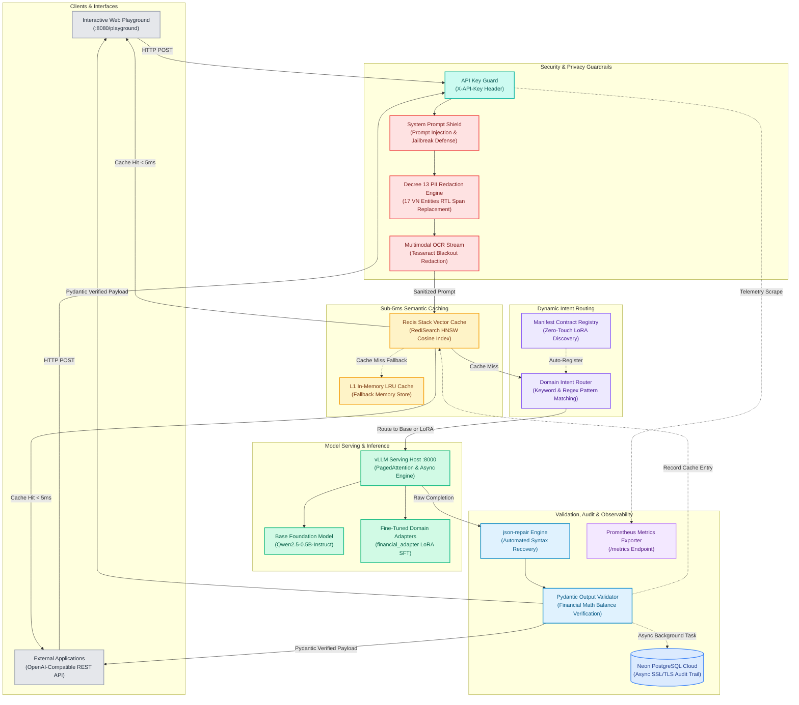

# AI Serving & Security Gateway

## Project Overview

A **Private Multimodal Serving & Security Gateway** with localized Vietnamese Data Protection Regulation (**Nghị định 13/2023/NĐ-CP**) compliance. The platform unifies **Dual-Stream Multimodal PII Redaction** (text & image OCR with non-overlapping right-to-left span offset replacement and pixel blackout), sub-5ms low-latency **Native HNSW Semantic Vector Caching** via Redis Stack, **Zero-Touch Dynamic LoRA Intent Routing** auto-discovered from MLOps `manifest.json` contracts, declarative **Pydantic Structured Output Validation** with arithmetic math balance verification and automated `json-repair`, **vLLM-backed LLM Serving**, asynchronous compliance audit logging to **Neon Serverless PostgreSQL** with SSL/TLS, real-time telemetry via **Prometheus**, and an offline 3-stage **QLoRA Fine-Tuning & Evaluation Pipeline**.

**Business Goal:** Provide banking, finance, and sensitive domain applications with a high-throughput, sub-5ms cached AI inference gateway that strictly enforces Decree 13/2023/NĐ-CP data privacy, halts prompt injections, prevents math hallucinations, and guarantees zero-downtime hot-swapping of fine-tuned domain LoRA adapters.

---

## Architecture & Tech Stack



* **High-Performance Gateway:**  +  +  (`pydantic-settings` singleton)
* **Privacy & Compliance Engine:**  +  + 
* **Low-Latency Vector Caching:**  (Cosine distance metric, sub-5ms SLA)
* **Model Serving Host:**  (OpenAI-compatible `/v1/chat/completions`, PagedAttention)
* **Fine-Tuning & MLOps:**  +  +  + 
* **Structured Output & Auto-Repair:**  + 
* **Compliance Audit Database:**  (`asyncpg` connection pool with SSL/TLS)
* **Observability & Telemetry:**  + 
* **Unit & Integration Testing:**  (`pytest-asyncio`)
* **Containerization:** 

---

## Intent Routing & LoRA Adapter Decision Matrix

The serving gateway dynamically routes user prompts to specialized fine-tuned domain adapters without requiring code changes or application restarts:

| Target Intent / Domain | Sample User Query | Routing Mechanism | Resolved Model / Adapter | Underlying Strategy & Handling |
| :--- | :--- | :--- | :--- | :--- |
| **Financial Extraction** | *"Chuyển 5.000.000 VND từ CCCD 079123456789 số thẻ 4111222233334444 cho số điện thoại 0901234567"* | Keyword matching (`chuyển tiền`, `stk`, `ngân hàng`) + Regex patterns | `financial_adapter` | Routes to QLoRA fine-tuned adapter; enforces `FinancialTransactionSchema` with arithmetic math validation |
| **Invoice / Receipt OCR** | Base64 invoice image payload with extracted text: *"Cộng tiền hàng: 100.000 đ, Thuế GTGT: 10.000 đ, Tổng cộng: 110.000 đ"* | Multimodal stream detector (`image_url`) + Financial keyword analyzer | `financial_adapter` | Applies 1-pass OCR blackout redaction, injects sanitized OCR block into prompt, evaluates math balance |
| **General Assistance** | *"Giải thích nguyên lý hoạt động của cơ chế PagedAttention trong vLLM"* | Fallback default route | `Qwen/Qwen2.5-0.5B-Instruct` | Direct invocation to base foundation model without adapter overhead |
| **Explicit Model Override** | Query with explicit `"model": "financial_adapter"` in JSON request body | Header / payload model parameter override | `financial_adapter` | Respects caller-specified model parameter over automatic intent detection |
| **Dynamic MLOps Discovery** | New domain adapter exported to `artifacts/runs/**/manifest.json` | Automatic directory scan (`auto_discover_from_artifacts`) | Discovered Adapter Name | Dynamically registers intent rules, keywords, and adapter paths on boot |

---

## Decree 13/2023/NĐ-CP Compliance & Security Architecture

The platform enforces data sovereignty and privacy compliance according to **Nghị định số 13/2023/NĐ-CP** (Bảo vệ dữ liệu cá nhân) across both text and multimodal image streams:

### 1. Classification of 17 Vietnamese PII Entities

| Decree 13 Category | Entity Code | Legal Definition (NĐ 13/2023/NĐ-CP) | Pattern / Detection Scope | Redaction Mask Token |
| :--- | :--- | :--- | :--- | :--- |
| **Sensitive Personal Data** | `GPS_LOCATION` | Điều 2 Khoản 4: Thông tin vị trí địa lý cá nhân | Geographic latitude/longitude coordinates | `[GPS_LOCATION_x]` |
| **Sensitive Personal Data** | `CREDIT_CARD` | Điều 2 Khoản 4: Dữ liệu tài khoản tài chính, số thẻ tín dụng | 13–19 digit credit card numbers (Visa, Mastercard, JCB) | `[CREDIT_CARD_x]` |
| **Sensitive Personal Data** | `BANK_ACCOUNT` | Điều 2 Khoản 4: Dữ liệu tài khoản ngân hàng (STK) | 8–16 digit account numbers preceded by `stk`, `số tk` | `[BANK_ACCOUNT_x]` |
| **Sensitive Personal Data** | `CVV_CVC` | Điều 2 Khoản 4: Mã bảo mật thẻ thanh toán | 3–4 digit CVV/CVC codes | `[CVV_CVC_x]` |
| **Sensitive Personal Data** | `OTP_PIN` | Điều 2 Khoản 4: Mã xác thực giao dịch, mã PIN | 4–8 digit OTP/PIN security codes | `[OTP_PIN_x]` |
| **Sensitive Personal Data** | `MEDICAL_RECORD_ID` | Điều 2 Khoản 4: Dữ liệu y tế và hồ sơ bệnh án | Medical record and health IDs (`ba`, `hsba`) | `[MEDICAL_RECORD_ID_x]` |
| **Basic Personal Data** | `CITIZEN_ID` | Điều 2 Khoản 3: Số định danh cá nhân, CCCD / CMND | 12-digit CCCD or 9-digit CMND numbers | `[CITIZEN_ID_x]` |
| **Basic Personal Data** | `PASSPORT_VN` | Điều 2 Khoản 3: Số hộ chiếu Việt Nam | Vietnamese passport format (`B`, `C`, `D`, `K` + 7 digits) | `[PASSPORT_VN_x]` |
| **Basic Personal Data** | `DRIVER_LICENSE` | Điều 2 Khoản 3: Giấy phép lái xe (GPLX) | 12-digit national driver's license numbers | `[DRIVER_LICENSE_x]` |
| **Basic Personal Data** | `TAX_ID` | Điều 2 Khoản 3: Mã số thuế (MST) cá nhân/doanh nghiệp | 10-digit or 13-digit tax identification numbers | `[TAX_ID_x]` |
| **Basic Personal Data** | `SOCIAL_SECURITY_ID`| Điều 2 Khoản 3: Mã số bảo hiểm xã hội (BHXH) | 10-digit national social security numbers | `[SOCIAL_SECURITY_ID_x]` |
| **Basic Personal Data** | `HEALTH_INSURANCE_ID`| Điều 2 Khoản 3: Mã thẻ bảo hiểm y tế (BHYT) | 15-character national health insurance codes | `[HEALTH_INSURANCE_ID_x]` |
| **Basic Personal Data** | `LICENSE_PLATE` | Điều 2 Khoản 3: Biển số xe cơ giới | Vietnamese automotive and motorcycle license plates | `[LICENSE_PLATE_x]` |
| **Basic Personal Data** | `PHONE_NUMBER` | Điều 2 Khoản 3: Số điện thoại di động | Vietnamese telecommunication prefixes (`03`, `05`, `07`, `08`, `09`, `+84`) | `[PHONE_NUMBER_x]` |
| **Basic Personal Data** | `EMAIL` | Điều 2 Khoản 3: Địa chỉ thư điện tử | Standard RFC-compliant email address format | `[EMAIL_x]` |
| **Basic Personal Data** | `IP_ADDRESS` | Điều 2 Khoản 3: Địa chỉ giao thức mạng Internet (IPv4) | Dotted-quad IPv4 network addresses | `[IP_ADDRESS_x]` |
| **Basic Personal Data** | `MAC_ADDRESS` | Điều 2 Khoản 3: Địa chỉ phần cứng thiết bị mạng | Colon/hyphen-separated 6-byte hexadecimal MAC addresses | `[MAC_ADDRESS_x]` |

### 2. Collision-Free Right-to-Left (RTL) Span Offset Replacement

Naive substring replacement (`text.replace(match, token)`) causes corruption when matched strings overlap or appear as substrings of larger identifiers. The engine applies an exact non-overlapping span offset algorithm:

1. **Regex Detection**: Scans the text across all 17 entity patterns and records `(start_index, end_index, entity_code, matched_text)`.
2. **Overlap Resolution**: Sorts detected spans by descending priority (Sensitive Data > Basic Data) and length, pruning conflicting spans.
3. **Right-to-Left Mutation**: Mutates the text strictly from highest string offset down to index `0`, guaranteeing that replacing earlier characters does not invalidate offsets of subsequent substrings.
4. **Reversible Token Mapping**: Maintains a volatile request-scoped `pii_mapping` dictionary (`{ "[CITIZEN_ID_1]": "079123456789" }`) in application memory to seamlessly restore entities into final human-readable summaries (`unmask_text`) while sending strictly sanitized tokens to the LLM.

### 3. Multimodal OCR 2-Stream Image Redaction

When invoices, banking slips, or receipts are provided as Base64 images:
* **Stream 1 (Visual Blackout)**: Tesseract OCR extracts bounding box coordinates (`x, y, w, h`) for every word. If a word or sequence matches a PII entity, Pillow draws a solid fill rectangle over the pixels, generating a redacted image preview for the user interface.
* **Stream 2 (Text Sanitization)**: Extracted OCR text is piped through the text PII masking engine and injected into the prompt context with isolated namespace tokens (`[OCR_CITIZEN_ID_1]`).

### 4. Rule-Based Prompt Injection Shield

Incoming prompts are verified against injection vectors (`ignore previous instructions`, `reveal system prompt`, `DAN mode`, `bypass safety filters`) before reaching the vector cache or LLM. Responses are validated against system instruction leakage before delivery.

---

## Core API Contracts & Storage Schemas

### 1. Chat Completions (`POST /v1/chat/completions`)

The serving layer adheres to OpenAI API conventions with extended security metadata:

#### Request Contract
```json
{
  "model": "auto",
  "messages": [
    {
      "role": "user",
      "content": "Chuyển 5.000.000 VND từ CCCD 079123456789 số thẻ 4111222233334444 cho số điện thoại 0901234567"
    }
  ],
  "temperature": 0.2,
  "max_tokens": 512
}
```

#### Response Contract (< 5ms on Cache Hit)
```json
{
  "request_id": "req-8f4b23a91c4e",
  "status": "success",
  "meta": {
    "execution_time_ms": 3.84,
    "pii_redacted_count": 3,
    "cached_hit": false,
    "json_auto_repaired": false,
    "schema_validated": true,
    "model_id": "financial_adapter"
  },
  "formats": {
    "structured_data": {
      "transaction_type": "TRANSFER",
      "amount": 5000000.0,
      "currency": "VND",
      "sender_account": "4111222233334444",
      "receiver_name": "0901234567"
    },
    "text_summary": "Đã thực hiện giao dịch chuyển tiền 5.000.000 VND từ CCCD 079123456789 số thẻ 4111222233334444 cho số điện thoại 0901234567."
  }
}
```

---

### 2. Pydantic Structured Output Contract (`FinancialTransactionSchema`)

To eliminate numerical hallucinations and formatting bugs, JSON outputs are validated via Pydantic:

```python
class FinancialTransactionSchema(BaseModel):
    transaction_type: str | None = Field(default="TRANSACTION")
    amount: float | None = Field(default=None, ge=0.0)
    currency: Literal["VND", "USD", "EUR", "JPY", ""] | None = "VND"
    sender_name: str | None = None
    sender_account: str | None = None
    receiver_name: str | None = None
    receiver_account: str | None = None
    subtotal: float | None = Field(default=None, ge=0.0)
    tax: float | None = Field(default=None, ge=0.0)
    total: float | None = Field(default=None, ge=0.0)

    @model_validator(mode="after")
    def verify_math_balance(self) -> "FinancialTransactionSchema":
        """Declaratively verifies arithmetic consistency: subtotal + tax == total."""
        if self.subtotal is not None and self.tax is not None and self.total is not None:
            expected = round(self.subtotal + self.tax, 2)
            if abs(expected - round(self.total, 2)) > 0.01:
                raise ValueError(
                    f"Arithmetic imbalance: subtotal ({self.subtotal}) + tax ({self.tax}) = {expected}, but total is {self.total}"
                )
        return self
```

* If an LLM returns malformed JSON with trailing commas or unescaped quotes, `json-repair` recovers the JSON tree before schema validation.

---

### 3. Neon PostgreSQL Cloud Audit Schema (`audit_logs`)

All requests are logged asynchronously via background tasks (`asyncpg` connection pool) without degrading response latency:

| Column Name | SQL Type | Nullable | Description |
| :--- | :--- | :---: | :--- |
| `id` | `SERIAL PRIMARY KEY` | No | Auto-incrementing audit log identifier |
| `request_id` | `VARCHAR(64)` | No | Indexed unique identifier for tracing (`idx_audit_request_id`) |
| `client_ip` | `VARCHAR(64)` | Yes | Originating client IP address |
| `masked_prompt` | `TEXT` | Yes | PII-sanitized prompt payload (never logs raw PII) |
| `model_id` | `VARCHAR(128)` | Yes | Active model or adapter ID resolved by the router |
| `response_formats` | `JSONB` | Yes | Sanitized structured and textual response payload |
| `pii_count` | `INT` | No | Number of PII entities detected and redacted |
| `cached_hit` | `BOOLEAN` | No | Cache hit flag (`TRUE` = served from Redis HNSW) |
| `execution_time_ms`| `FLOAT` | No | End-to-end gateway execution latency in milliseconds |
| `status_code` | `INT` | No | HTTP status code returned to client |
| `created_at` | `TIMESTAMPTZ` | No | Indexed UTC timestamp of the request (`idx_audit_created_at`) |

---

## Offline Foundation Model Adaptation Pipeline (MLOps)

The repository provides a modular, reproducible 3-stage offline pipeline for training and packaging domain-specific LoRA adapters:

```
[Raw JSONL Dataset] ──► [Stage 1: Dataset Validator] ──► [Stage 2: QLoRA Train Engine] ──► [Stage 3: Eval Engine] ──► [manifest.json Contract]
```

### Stage 1: Dataset Canonicalization & PII Audit (`training/src/dataset_validator.py`)
* Validates schema format (`instruction`, `input`, `output`), performs deduplication via MD5 hash registry, conducts PII leakage screening, and generates deterministic train/val splits (e.g., 90/10).

### Stage 2: Contract-First SFT / QLoRA Engine (`training/src/train_engine.py`)
* Supports `--dry-run` to validate tokenizer token budgets and estimate GPU VRAM consumption.
* Executes 4-bit quantized Low-Rank Adaptation (QLoRA) using HuggingFace `peft` and `bitsandbytes`, saving adapter weights to `artifacts/runs/<run_id>/adapter/`.

### Stage 3: Offline 4-Way Evaluation & Manifest Packaging (`training/src/eval_engine.py`)
* Computes JSON validity rate, Pydantic schema compliance rate, and field-level key extraction accuracy.
* Packages artifacts with an MLOps `manifest.json` contract that the online gateway automatically discovers on boot.

---

## End-to-End System Workflow

```
[Client / UI Request] ──► [Prompt Guardrails] ──► [Decree 13 PII Redaction] ──► [HNSW Semantic Cache] ──► [LoRA Intent Router] ──► [vLLM Serving Host] ──► [Pydantic Validation & Auto-Repair] ──► [Neon Audit & Metrics]
```

### 1. Request Ingestion & Security Guardrails
* The client sends a request to `POST /v1/chat/completions` with an `X-API-Key` header.
* `GuardrailsEngine` inspects the prompt against jailbreak and system instruction leakage patterns.

### 2. Multimodal OCR & Non-Overlapping PII Redaction
* If images are attached, `PresidioPIIEngine` applies Tesseract OCR and draws visual blackout rectangles.
* The text stream is scanned across 17 Decree 13 entity definitions. Entities are replaced using Right-to-Left span replacement, populating a volatile token mapping.

### 3. Native RediSearch HNSW Vector Caching (Sub-5ms SLA)
* Sanitized text is hashed into a 128-dimensional embedding and queried against Redis Stack via `FT.SEARCH` with Cosine distance.
* **Cache Hit**: Gateway unmasks tokens and immediately returns the cached payload under 5ms, offloading compute from vLLM.
* **Cache Miss**: Request proceeds to the Intent Router.

### 4. Dynamic LoRA Intent Routing & Manifest Auto-Discovery
* `IntentRouter` evaluates keywords and regex patterns or reads explicit `model` parameters.
* Resolves whether to route to the base model (`Qwen2.5-0.5B-Instruct`) or a specialized LoRA adapter (`financial_adapter`).

### 5. vLLM Serving & Pydantic Auto-Repair Validation
* The gateway calls vLLM with sanitized messages.
* Raw completion is parsed: if syntax errors exist, `json-repair` automatically recovers valid JSON.
* Output is validated against `FinancialTransactionSchema` (verifying `subtotal + tax == total`).
* Entities are restored into the textual summary using the request-scoped mapping.

### 6. Asynchronous Cloud Audit Logging & Telemetry
* Background task dispatches sanitized audit trail to Neon PostgreSQL pool.
* Background task stores sanitized response in Redis Stack HNSW cache.
* Prometheus metrics counter and latency histograms are updated at `/metrics`.

---

## Key Engineering Highlights

* **Decree 13/2023/NĐ-CP Compliant Privacy Engine:** Complete coverage of 17 localized Vietnamese PII entity types, structured across Basic Personal Data (Điều 2 Khoản 3) and Sensitive Personal Data (Điều 2 Khoản 4).
* **Right-to-Left Non-Overlapping Span Replacement:** Eliminates substring corruption bugs and race conditions common in naive text substitution.
* **Sub-5ms HNSW Semantic Vector Caching:** Native Redis Stack RediSearch vector indexing offloads repetitive inference calls with sub-5ms response latency.
* **Zero-Touch LoRA Manifest Auto-Discovery:** Seamlessly discovers, validates, and registers fine-tuned LoRA adapters directly from `manifest.json` files without restarting the gateway.
* **Declarative Financial Math Balancing:** Pydantic `model_validator` checks verify line-item arithmetic consistency (`subtotal + tax == total`), eliminating LLM calculation hallucinations.
* **Automated Syntax Recovery via `json-repair`:** Recovers malformed JSON from raw LLM outputs (unclosed quotes, trailing commas) without triggering API 500 exceptions.
* **Non-Blocking Cloud Compliance Logging:** Asynchronously writes sanitized audit records to Neon Serverless PostgreSQL with SSL/TLS, ensuring zero impact on user-facing latency.
* **3-Stage Contract-First QLoRA Adaptation Pipeline:** Modular offline training pipeline supporting `--dry-run` VRAM estimation, contract validation, and 4-way evaluation.
* **Interactive Web Cockpit & Real-time Metrics:** Modern dark-mode UI for testing text/image redaction alongside native Prometheus metric exports at `/metrics`.

---

## Project Structure

```
llm-serving-gateway/
│
├── docker-compose.yml                 # Gateway, vLLM, Redis Stack & Prometheus orchestration
├── conftest.py                        # Root sys.path & pytest fixtures
├── pytest.ini                         # Pytest runner configuration
├── requirements.txt                   # Production dependencies manifest
├── .env.example                       # Environment configuration template
│
├── gateway/                           # Online FastAPI Serving Gateway & Web Cockpit
│   ├── Dockerfile                     # Containerization build manifest
│   └── app/
│       ├── main.py                    # FastAPI entrypoint, lifespan & OpenAI-compatible routes
│       ├── config/                    # Centralized settings package (pydantic-settings)
│       │   ├── __init__.py
│       │   └── settings.py            # Centralized settings & Pathlib directory resolver
│       │
│       ├── core/                      # Core security, caching, routing & validation engines
│       │   ├── presidio_engine.py     # Decree 13 PII redaction engine & multimodal OCR
│       │   ├── semantic_cache.py      # Native RediSearch HNSW Vector Cache & L1 LRU
│       │   ├── intent_router.py       # Dynamic intent classifier & manifest auto-discovery
│       │   ├── output_validator.py    # Structured Output Parser & Pydantic Schema Validator
│       │   └── guardrails_engine.py   # Guardrails prompt injection & leakage defense
│       │
│       ├── db/
│       │   └── neon_audit_logger.py   # Asynchronous Neon PostgreSQL audit logger (SSL/TLS)
│       │
│       ├── static/                    # Interactive Web Playground & Security Cockpit
│       │   ├── index.html             # Split-panel cockpit UI (Input, Output, OCR, Metadata)
│       │   ├── style.css              # Dark-tech theme stylesheet
│       │   └── app.js                 # Reactive frontend controller
│       │
│       └── utils/
│           └── logger.py              # Centralized ISO-8601 logger
│
├── training/                          # Offline Foundation Model Adaptation Pipeline (MLOps)
│   ├── run_pipeline.py                # CLI Orchestrator (--dry-run, --smoke-test, --stage)
│   ├── configs/
│   │   └── dev.yaml                   # QLoRA hyperparameters, dataset & routing metadata
│   ├── data/
│   │   └── raw/                       # Raw financial transaction JSONL datasets
│   └── src/                           # Modular adaptation pipeline engines
│       ├── config_schema.py           # Pipeline YAML configuration schema
│       ├── dataset_validator.py       # Stage 1: Dataset canonicalization, dedup & PII audit
│       ├── train_engine.py            # Stage 2: Contract-first QLoRA adapter training engine
│       ├── eval_engine.py             # Stage 3: Offline 4-way evaluation engine
│       ├── manifest_builder.py        # Manifest builder & contract publisher
│       └── utils/
│           └── logger.py              # Training pipeline logger
│
├── tests/                             # Comprehensive Modular Test Suite (pytest)
│   ├── test_decree13_pii_engine.py    # Decree 13 entity masking, unmasking & collision tests
│   ├── test_foundation_model_pipeline.py # 3-Stage adaptation pipeline & manifest contract tests
│   ├── test_gateway_core_engines.py   # Guardrails, cache similarity, schema & math balance tests
│   ├── test_gateway_e2e_pipeline.py   # End-to-end gateway authentication, OCR & injection tests
│   ├── test_infrastructure_config.py  # Docker compose, env example & requirements tests
│   ├── test_model_routing_live.py     # Intent router logic & live routing tests
│   └── test_telemetry_observability.py # Health, Prometheus metrics & Neon audit schema tests
│
├── artifacts/                         # Generated model runs & manifest contracts (local)
└── logs/                              # Application execution logs
```

---

## Environment Configuration Reference

The platform utilizes centralized Pydantic Settings (`gateway/app/config/settings.py`) loaded from `.env`:

| Variable | Category | Type | Default Value | Description |
| :--- | :--- | :---: | :--- | :--- |
| `VLLM_BASE_URL` | Serving Host | `str` | `http://localhost:8000/v1` | Base URL for OpenAI-compatible vLLM inference server |
| `VLLM_MODEL_NAME` | Serving Host | `str` | `Qwen/Qwen2.5-0.5B-Instruct` | Target foundation model identifier |
| `HF_TOKEN` | Serving Host | `str` | `None` | HuggingFace Hub token for gated model downloads |
| `REDIS_HOST` | Cache / Vector | `str` | `localhost` | Redis Stack server host address |
| `REDIS_PORT` | Cache / Vector | `int` | `6379` | Redis Stack server port |
| `REDIS_PASSWORD` | Cache / Vector | `str` | `None` | Optional password for Redis authentication |
| `SEMANTIC_CACHE_THRESHOLD` | Cache / Vector | `float` | `0.95` | Cosine similarity threshold for semantic cache hit (0.0–1.0) |
| `SEMANTIC_CACHE_TTL_SECONDS` | Cache / Vector | `int` | `86400` | Expiration time for cached prompt entries in seconds (24h) |
| `GATEWAY_HOST` | Gateway Core | `str` | `0.0.0.0` | Listening host for FastAPI gateway |
| `GATEWAY_PORT` | Gateway Core | `int` | `8080` | Listening port for FastAPI gateway |
| `GATEWAY_API_KEY` | Security | `str` | `secret_ai_gateway_key_2026` | Shared secret API key for `X-API-Key` authentication |
| `NEON_DATABASE_URL` | Audit DB | `str` | `""` | Neon Serverless PostgreSQL connection URL with SSL mode |
| `GRAFANA_CLOUD_REMOTE_WRITE_URL` | Observability | `str` | `""` | Optional Grafana Cloud Prometheus remote write URL |
| `GRAFANA_CLOUD_USER` | Observability | `str` | `""` | Grafana Cloud username for metrics push |
| `GRAFANA_CLOUD_API_KEY` | Observability | `str` | `""` | Grafana Cloud API key for authentication |

---

## How to Run

### 1. Clone and Configure Environment

```bash
# Clone the repository
git clone https://github.com/hovngnvm/llm-serving-gateway.git
cd llm-serving-gateway

# Copy template configuration
cp .env.example .env
# Edit .env with your credentials (Neon Database URL, Hugging Face Token, API Key)
```

### 2. Setup Python Virtual Environment

```bash
# Create and activate virtual environment
python -m venv .venv
source .venv/bin/activate  # On Windows: .venv\Scripts\activate

# Install platform dependencies
pip install -r requirements.txt
```

### 3. Run Automated Test Suite Verification

Verify core security engines, HNSW caching, Pydantic math balance, and E2E routes:

```bash
pytest -v
```

### 4. Launch Infrastructure Services (Docker)

Boot up Redis Stack (vector cache & RedisInsight) and Prometheus:

```bash
docker compose up -d redis-cache prometheus
```

*Verify service status:*
* **RedisInsight Dashboard:** `http://localhost:8001`
* **Prometheus Server:** `http://localhost:9090`

*(Optional) Start local GPU vLLM serving container:*
```bash
docker compose up -d vllm-server
```

### 5. Start AI Serving Gateway Server

```bash
python -m uvicorn gateway.app.main:app --host 0.0.0.0 --port 8080 --reload
```

*Access interactive service interfaces:*
* **Interactive Playground Cockpit:** `http://localhost:8080/` (or `/playground`)
* **Swagger API Documentation:** `http://localhost:8080/docs`
* **Prometheus Metrics:** `http://localhost:8080/metrics`
* **Health & Cache Diagnostics:** `http://localhost:8080/health`

### 6. Run Offline Adaptation Pipeline (QLoRA & Contract Verification)

Execute the 3-stage offline pipeline to validate datasets, run QLoRA SFT, and export manifest contracts:

```bash
# Dry-run validation (Dataset format, token budget & VRAM estimation)
python -m training.run_pipeline --config training/configs/dev.yaml --dry-run

# End-to-end contract verification, LoRA adapter generation & manifest packaging
python -m training.run_pipeline --config training/configs/dev.yaml --smoke-test
```

### 7. Explore Interactive Web Playground & Cockpit

Navigate to **`http://localhost:8080/`** in your browser to test:
* **Decree 13 PII Redaction:** Try the pre-filled quick prompts for banking, invoices, or personal data.
* **Multimodal Image OCR:** Upload a transaction slip to test real-time pixel blackout and OCR entity masking.
* **Semantic Caching:** Resubmit identical queries to verify `< 5ms` cache hit responses.
* **Math Balance Rejection:** Verify that mathematically inconsistent invoices are rejected or flagged.
* **Prompt Injection Shield:** Submit jailbreak patterns to test immediate 400 Bad Request rejection.
