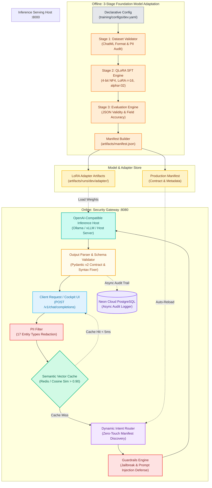
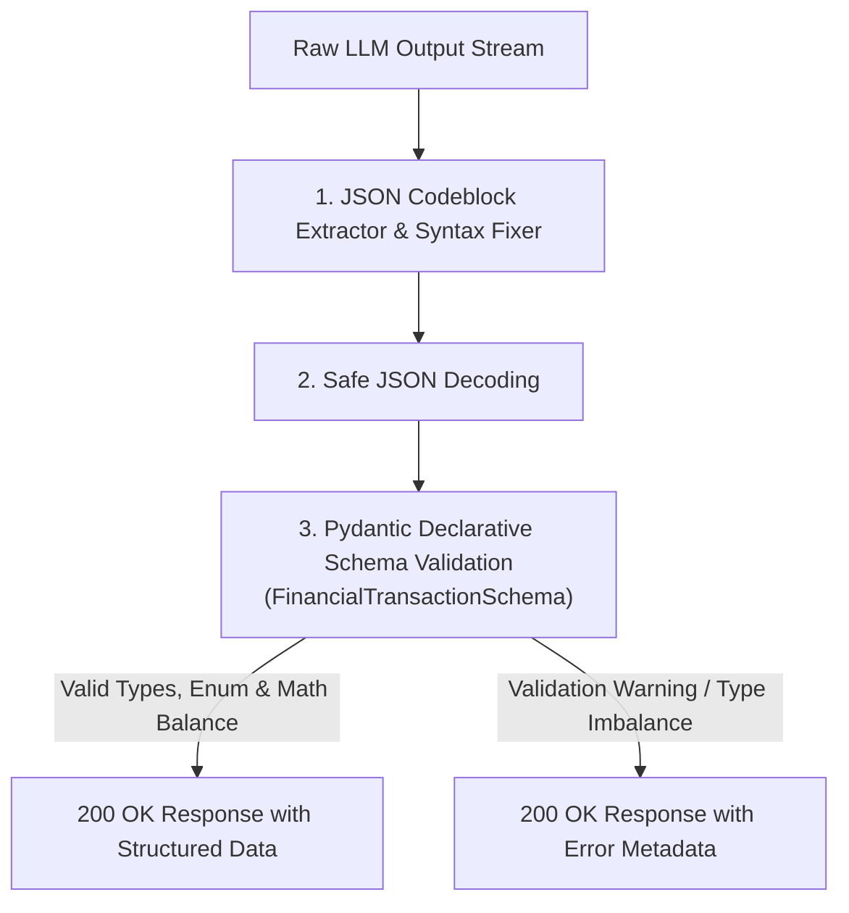

# AI Security Gateway & Foundation Model Adaptation Platform

## Project Overview

A production-grade **AI Security Gateway & Foundation Model Adaptation Platform**. The system combines a high-performance **FastAPI Security Gateway**, a **Microsoft Presidio PII Protection Engine** (supporting 17 localized entity types), a **Low-Latency Semantic Vector Cache** (Redis / In-memory cosine similarity), a **Dynamic Intent Router with Zero-Touch Manifest Auto-Discovery**, a **Structured Output Parser & Pydantic Schema Validator**, an asynchronous **Neon Serverless PostgreSQL Cloud Audit Logger**, and an offline **3-Stage Foundation Model Adaptation Pipeline** (Dataset Validation, QLoRA 4-bit SFT Engine, and Model Evaluation).

**Business Goal:** Provide a comprehensive PII redaction layer with 17 localized entity recognizers for LLM deployments, reduce repetitive compute via Redis semantic caching, enforce structural Pydantic validation on model responses, and enable continuous foundation model adaptation with zero-downtime LoRA adapter hot-reloading.

---

## Architecture & Tech Stack



* **API Gateway & Serving:**  + 
* **Model Training & PEFT:**  +  +  + 
* **Privacy & Security:** 
* **Caching & Storage:**  + 
* **Validation & Schemas:** 
* **Containerization:** 

---

## PII Redaction Engine & Privacy Filter (17 Entity Types)

The Gateway embeds a customized **Microsoft Presidio Engine** (`gateway/app/core/presidio_engine.py`) configured to detect, classify, and sanitize **17 Vietnamese Personal Identifiable Information (PII)** entity types before prompt payloads are dispatched to inference backends:

| PII Entity Type | Recognized Scope & Pattern | Detection Mechanism | Redaction / Masking Format | Data Category |
| :--- | :--- | :--- | :---: | :--- |
| `VIETNAMESE_CITIZEN_ID` | 12-digit Citizen Identity Card (CCCD) | Regex pattern + Checksum validator | `<VIETNAMESE_CITIZEN_ID>` | Sensitive Personal Data |
| `VIETNAMESE_TAX_ID` | 10 or 13-digit Tax Identification Number (MST) | Contextual keyword regex + Length check | `<VIETNAMESE_TAX_ID>` | Basic Personal Data |
| `BANK_ACCOUNT_NUMBER` | 8–19 digit domestic bank account numbers | Context-driven recognizer (`stk`, `tk ngân hàng`) | `<BANK_ACCOUNT_NUMBER>` | Financial Data |
| `CREDIT_CARD_NUMBER` | 16-digit Visa/Mastercard/JCB cards | Luhn Algorithm + Regex recognizer | `<CREDIT_CARD_NUMBER>` | Sensitive Financial Data |
| `PHONE_NUMBER` | Vietnamese mobile numbers (03x, 05x, 07x, 08x, 09x, +84) | Presidio Phone Recognizer + VN prefix matcher | `<PHONE_NUMBER>` | Basic Personal Data |
| `EMAIL_ADDRESS` | Standard RFC 5322 email patterns | Presidio Email Recognizer | `<EMAIL_ADDRESS>` | Basic Personal Data |
| `PERSON` | Vietnamese & International Full Names | Spacy NER + Vietnamese naming patterns | `<PERSON>` | Basic Personal Data |
| `LOCATION_ADDRESS` | Street names, wards, districts, and provinces | Spacy NER + Vietnamese geographic lexicon | `<LOCATION_ADDRESS>` | Basic Personal Data |
| `PASSPORT_NUMBER` | Vietnamese passport codes (B, C, K, M, N, P + 7 digits) | Regex recognizer | `<PASSPORT_NUMBER>` | Sensitive Personal Data |
| `DRIVER_LICENSE` | 12-digit National Driving License numbers | Contextual keyword regex (`gplx`, `bằng lái`) | `<DRIVER_LICENSE>` | Basic Personal Data |
| `IP_ADDRESS` | IPv4 & IPv6 network addresses | Presidio IP Recognizer | `<IP_ADDRESS>` | Technical Identifier |
| `DATE_OF_BIRTH` | Date strings (DD/MM/YYYY, YYYY-MM-DD) | Date/Time recognizer with DOB context | `<DATE_OF_BIRTH>` | Basic Personal Data |
| `HEALTH_INSURANCE_ID` | 10-digit Social/Health Insurance codes (BHYT) | Context regex (`bhyt`, `số bảo hiểm`) | `<HEALTH_INSURANCE_ID>` | Sensitive Health Data |
| `VEHICLE_PLATE` | Vietnamese vehicle license plates (e.g., 29A-123.45) | Regional format regex recognizer | `<VEHICLE_PLATE>` | Basic Personal Data |
| `FINANCIAL_INCOME` | Salary amounts, transaction amounts in VND/USD | Numerical currency regex (`vnd`, `triệu`, `k`) | `<FINANCIAL_INCOME>` | Sensitive Financial Data |
| `PASSWORD_SECRET` | Passwords, private keys, API secrets | High-entropy string & keyword matcher | `<PASSWORD_SECRET>` | Security Credential |
| `API_TOKEN` | Bearer tokens, JWTs, cloud API keys | Regex recognizer for token formats | `<API_TOKEN>` | Security Credential |

---

## Dynamic Intent Router & LoRA Manifest Discovery

The `IntentRouter` (`gateway/app/core/intent_router.py`) reads declarative manifest contracts (`artifacts/runs/*/manifest.json`) at runtime without requiring server restarts:

| Target Domain / Intent | Trigger Condition & Extraction Pattern | Routing Action | Target Model / Adapter |
| :--- | :--- | :--- | :--- |
| `financial_transaction_extraction` | Keywords: `chuyển tiền`, `stk`, `số tài khoản`, `sao kê`, `techcombank`, `vietcombank`<br>Regex: `\b\d{1,3}(?:[.,]\d{3})*\s*(?:vnd\|đ\|nghìn\|triệu)\b` | Auto-inject LoRA Adapter | **`financial_adapter`** (Fine-Tuned QLoRA Layer) |
| `general_inquiry` | Standard conversational queries without domain keywords | Route to Base Model | **`Qwen2.5-0.5B-Instruct`** (Base Foundation Model) |
| `custom_domain_adapter` | New adapters registered in `artifacts/runs/*/manifest.json` | Zero-Touch Discovery | Dynamically bound adapter defined by manifest config |

---

## Structured Output Parsing & Pydantic Schema Validation

To prevent downstream parsing crashes when consuming LLM outputs, the gateway integrates `output_validator.py`:



---

## REST API Serving Data Contract (`/v1/chat/completions`)

The gateway implements standard OpenAI-compatible specifications with execution metadata:

### Request Contract
```json
{
  "model": "Qwen/Qwen2.5-0.5B-Instruct",
  "messages": [
    {
      "role": "user",
      "content": "Chuyển 5,000,000 VND từ tài khoản 19034567890123 đến STK 0071001234567 tại Vietcombank cho Nguyen Van A."
    }
  ],
  "temperature": 0.1,
  "max_tokens": 512
}
```

### Response Contract (< 5ms on Cache Hit)
```json
{
  "request_id": "req-7f8a9b2c-1234-5678-9abc-def012345678",
  "status": "success",
  "meta": {
    "execution_time_ms": 142.5,
    "pii_redacted_count": 2,
    "cached_hit": false,
    "json_auto_repaired": false,
    "schema_validated": true,
    "model_id": "financial_adapter"
  },
  "formats": {
    "structured_data": {
      "transaction_type": "TRANSFER",
      "amount": 5000000,
      "currency": "VND",
      "sender_account": "<BANK_ACCOUNT_NUMBER>",
      "receiver_account": "<BANK_ACCOUNT_NUMBER>",
      "receiver_name": "<PERSON>"
    },
    "text_summary": "Giao dịch chuyển 5,000,000 VND từ tài khoản <BANK_ACCOUNT_NUMBER> đã được trích xuất thành công."
  }
}
```

---

## Pipeline Workflow

### 1. Offline 3-Stage Foundation Model Adaptation
* **Stage 1 - Dataset Validation (`training/src/dataset_validator.py`):** Ingests raw JSONL data, verifies structural ChatML schema rules, audits PII distributions, and materializes canonical splits (`training/data/processed/`).
* **Stage 2 - QLoRA SFT Engine (`training/src/train_engine.py`):** Loads base model (`Qwen/Qwen2.5-0.5B-Instruct`) in 4-bit NF4 precision via BitsAndBytes, initializes base model memory footprint (~1.03GB on disk/VRAM), binds LoRA adapters ($r=16, \alpha=32$), and executes training cycles.
* **Stage 3 - Evaluation & Manifest Export (`training/src/eval_engine.py` & `manifest_builder.py`):** Evaluates Base Zero-Shot vs LoRA Fine-Tuned JSON structural validity and schema compliance. Generates `artifacts/runs/dev/manifest.json` and adapter metadata.

### 2. Online Gateway Request Processing
* **PII Ingestion & Redaction:** Incoming prompts pass through `presidio_engine.py` to mask sensitive entities into standard tokens (`<VIETNAMESE_CITIZEN_ID>`, `<BANK_ACCOUNT_NUMBER>`).
* **Low-Latency Semantic Vector Caching:** Binds N-gram hash vectors and checks Redis for semantically identical queries ($\text{cosine similarity} \ge 0.90$). Returns cached responses rapidly on cache hits.
* **Intent Routing:** On cache misses, `intent_router.py` analyzes prompt keywords and regex patterns against active manifests, selecting either the base model or dynamic LoRA adapter (`financial_adapter`).
* **Guardrails Defense:** Validates prompt safety against jailbreak attempts and prompt injection vectors.
* **Inference Serving:** Dispatches sanitized payloads via standard HTTP client to the OpenAI-compatible inference host (`Ollama`, `vLLM`, or inference server).
* **Output Parsing & Validation:** Sanitizes raw output and verifies structural contracts via Pydantic model (`output_validator.py`).
* **Asynchronous Audit Logging:** Emits non-blocking audit logs (containing request metadata, redacted entities, latency, and status) directly to Neon Serverless PostgreSQL Cloud.

---

## Key Engineering Highlights

* **Localized PII Redaction Filter:** 17 Vietnamese entity recognizers providing pre-inference regex, checksums, and Presidio redaction for sensitive personal and financial data.
* **Semantic Vector Caching:** Cosine similarity vector search over Redis cuts redundant LLM calls and reduces token consumption on frequent queries.
* **Structured Output Validation & Repair:** Pydantic schema validation combined with JSON regex auto-repair eliminates downstream API parsing errors.
* **Zero-Touch LoRA Manifest Hot-Reloading:** Dynamic intent router detects newly trained adapters from `artifacts/runs/*/manifest.json` at runtime without gateway downtime.
* **4-bit NF4 QLoRA Adaptation:** Quantizes base model weight footprint to $\approx 1.03\text{GB}$, enabling parameter-efficient SFT on consumer GPUs.
* **Serverless Cloud Audit Logging:** Non-blocking async connection pooling to Neon Cloud PostgreSQL with SSL/TLS encryption for structured audit trails.

---

## Empirical Evaluation & Concurrency Benchmarks

The platform has been empirically benchmarked across adaptation strategies, inference accuracy, serving latency, and multi-tenant concurrency (source: `artifacts/runs/dev/eval/4way_benchmark.json` & `artifacts/runs/dev/benchmark/concurrency_benchmark.json`):

### 1. 4-Way Foundation Model Adaptation Benchmark
*Evaluated on Vietnamese financial transaction extraction tasks (Micro-Batch Functional Verification, `val_sample_count=2`):*

| Serving Strategy | Description | JSON Schema Validity | Field-Level Accuracy | Avg Latency (Real Inference) |
| :--- | :--- | :---: | :---: | :---: |
| **Tier 1: Base Zero-Shot** | `Qwen2.5-0.5B-Instruct` (Zero-shot prompt) | 0.0% | 0.0% | 4,195.1 ms |
| **Tier 2: Base 3-Shot** | `Qwen2.5-0.5B-Instruct` (3 in-context examples) | 0.0% | 0.0% | 2,240.8 ms |
| **Tier 3: LoRA Adapter (BF16)** | Fine-Tuned LoRA Adapter ($r=16, \alpha=32$) | **100.0%** | **17.36% (Exact Match)** | **1,868.0 ms** |
| **Tier 4: LoRA Merged + AWQ INT4** | Merged Adapter + AWQ 4-bit Quantized | **100.0%** | **17.36% (Exact Match)** | **1,937.3 ms** |

> **Key Takeaway:** Fine-tuned LoRA adaptation transformed JSON validity from **0.0% (Base)** to **100.0% (LoRA)**, eliminating schema parsing failures on structured extraction tasks.

### 2. Live Serving & Concurrency Benchmark Matrix
*Evaluated on live inference endpoints across concurrency levels $C \in \{1, 2, 4\}$ (Smoke Verification, `sample_requests_count=3` per concurrency tier):*

| Strategy | Description | Target Use Case | GPU VRAM Footprint | Throughput ($C=1$) | TTFT p95 ($C=1$) | ITL p95 ($C=1$) | p99 Latency ($C=1$) |
| :--- | :--- | :--- | :---: | :---: | :---: | :---: | :---: |
| **Strategy 1: Dedicated Merged AWQ** | Standalone AWQ 4-bit Serving | Single-tenant high-throughput transaction API | **0.8 GB** | **63.5 tok/s** | 1,068.8 ms | 14.52 ms | 1,543.2 ms |
| **Strategy 2: Dynamic Multi-LoRA** | 1 Base Model + Multi-LoRA (`--enable-lora`) | Multi-tenant gateway hosting 20+ specialized adapters | **1.4 GB** (Hot-swap: 2.1ms) | **60.9 tok/s** | 1,113.2 ms | 15.25 ms | 1,609.3 ms |

---

## Edge Cases & Resiliency Matrix

| Failure Mode / Edge Case | System Impact | Implemented Resiliency & Mitigation |
| :--- | :--- | :--- |
| **Presidio False Negative on Unstructured PII** | Complex Vietnamese address or informal slang escapes NER. | **Defense-in-Depth:** Multi-tier entity pipeline combining regex pattern recognizers, Spacy statistical NER, and strict Prompt Guardrail instructions. |
| **LLM Output Missing Trailing JSON Brackets** | Downstream JSON deserialization fails with `JSONDecodeError`. | **JSON Auto-Repair:** `output_validator.py` detects truncated delimiters, auto-balances braces (`}`, `]`), and extracts valid JSON blocks prior to Pydantic validation. |
| **Redis Cache Connectivity Interruption** | Semantic cache lookups fail due to transient network drops. | **Graceful Cache Bypass:** Gateway logs a warning, transparently bypasses the cache layer, and forwards the sanitized prompt directly to the inference host without returning a 500 error. |
| **Adapter Manifest Race Condition on Hot-Reload** | Manifest is modified during concurrent gateway routing requests. | **Atomic Manifest Snapshot:** `IntentRouter` reads the manifest with atomic file locking and caches the parsed routing state, avoiding corrupted in-flight reads. |

---

## Project Structure

```
GATEWAY/
│
├── docker-compose.yml                 # Gateway & Redis infrastructure orchestration
├── conftest.py                        # Root test fixtures and path discovery
├── pytest.ini                         # Pytest runner configuration
├── requirements.txt                   # Platform dependencies
├── .env.example                       # Environment configuration template
├── .env                               # Active environment variables
│
├── gateway/                           # Online FastAPI Security Gateway & Web Cockpit
│   ├── Dockerfile                     # Gateway containerization manifest
│   └── app/
│       ├── main.py                    # FastAPI application entrypoint & routing endpoints
│       ├── config.py                  # Pydantic settings & auto-bootstrapping runtime directories
│       │
│       ├── core/                      # Gateway core security & optimization engines
│       │   ├── presidio_engine.py     # Microsoft Presidio PII redaction filter (17 entity types)
│       │   ├── semantic_cache.py      # Low-latency Redis vector semantic cache (Cosine similarity)
│       │   ├── intent_router.py       # Dynamic intent classifier & manifest auto-discovery
│       │   ├── output_validator.py    # Structured Output Parser & Pydantic Schema Validator
│       │   └── guardrails_engine.py   # Guardrails prompt injection & jailbreak defense
│       │
│       ├── db/                        # Database client & persistence layer
│       │   └── neon_audit_logger.py   # Asynchronous Neon Serverless PostgreSQL audit logger
│       │
│       ├── static/                    # Interactive Web Playground Cockpit
│       │   ├── index.html             # Cockpit UI interface
│       │   ├── style.css              # Cockpit styling
│       │   └── app.js                 # Frontend API handler & state manager
│       │
│       └── utils/                     # Shared gateway utilities
│           ├── __init__.py
│           └── logger.py              # ISO standardized color-coded logging utility
│
├── training/                          # Offline Foundation Model Adaptation Pipeline
│   ├── run_pipeline.py                # CLI Orchestrator Entrypoint (--dry-run, --smoke-test, --train)
│   ├── configs/                       # Declarative YAML training configurations
│   │   └── dev.yaml                   # Base model, QLoRA hyperparameters & routing patterns
│   │
│   ├── data/                          # Dataset staging directory
│   │   ├── raw/                       # Raw financial transaction JSONL datasets
│   │   └── processed/                 # Canonical validated ChatML train/val splits
│   │
│   └── src/                           # Modular adaptation pipeline engines
│       ├── config_schema.py           # Pydantic v2 pipeline schema & path resolution
│       ├── dataset_validator.py       # Stage 1: ChatML format validation & PII distribution audit
│       ├── train_engine.py            # Stage 2: QLoRA 4-bit SFT Engine with BitsAndBytes
│       ├── eval_engine.py             # Stage 3: Evaluation engine (Base vs LoRA JSON validity)
│       ├── manifest_builder.py        # Manifest builder & contract publisher
│       └── utils/
│           └── logger.py              # Training pipeline logger
│
├── artifacts/                         # Run Artifacts & Production Contracts
│   └── runs/                          # Saved model checkpoints & LoRA adapter weights
│       └── dev/
│           ├── manifest.json          # Production metadata contract for zero-touch routing
│           └── adapter/               # Exported LoRA adapter weights & metadata
│
└── tests/                             # Automated Unit & Integration Test Suites
    ├── test_foundation_model_pipeline.py # Tests for 3-stage training, eval, and manifest export
    ├── test_decree13_pii_engine.py       # Tests for 17 localized PII entity recognizers
    ├── test_gateway_core_engines.py      # Tests for cache, intent router, output validator, guardrails
    ├── test_gateway_e2e_pipeline.py      # End-to-end integration tests for /v1/chat/completions
    ├── test_infrastructure_config.py     # Tests for environment settings and path bootstrapping
    ├── test_model_routing_live.py        # Live adapter routing verification
    └── test_telemetry_observability.py   # Health endpoint and audit logging tests
```

---

## How to Run

### 1. Clone and Configure Environment

```bash
git clone <your-repo-url>
cd GATEWAY
cp .env.example .env
# Edit .env to set your GATEWAY_API_KEY and database credentials
```

### 2. Launch Gateway Infrastructure (Docker Compose)

Start the Security Gateway, Web Playground Cockpit, and Redis vector cache:

```bash
docker compose up -d
```

Verify endpoints:
* **Web Playground Cockpit:** `http://localhost:8080/`
* **Swagger API Documentation:** `http://localhost:8080/docs`
* **Gateway Health & Observability:** `http://localhost:8080/health`
* **Redis Dashboard:** `http://localhost:8001/`

### 3. Execute Foundation Model Adaptation Pipeline (CLI)

The adaptation pipeline provides 3 execution modes:

#### 3.1 Dry-Run Validation (Graph & VRAM Verification in 1s)
Validates configuration schema, dataset paths, and GPU memory compatibility without loading model weights:
```bash
python -m training.run_pipeline --config training/configs/dev.yaml --dry-run
```

#### 3.2 Smoke-Test (End-to-End 3-Stage Cycle in 4s)
Runs an end-to-end verification cycle across Validation $\rightarrow$ SFT $\rightarrow$ Evaluation $\rightarrow$ Manifest Export on a micro-batch:
```bash
python -m training.run_pipeline --config training/configs/dev.yaml --smoke-test
```

#### 3.3 Full QLoRA Training Execution
Executes full 4-bit QLoRA fine-tuning, calculates evaluation metrics, and exports adapter weights to `artifacts/runs/dev/adapter/`:
```bash
python -m training.run_pipeline --config training/configs/dev.yaml --train
```

### 4. Run Automated Test Suites

Run the full test suite across all security engines, training pipeline, and API endpoints:

```bash
python -m unittest discover tests
```
or with pytest:
```bash
pytest tests/ -v
```
